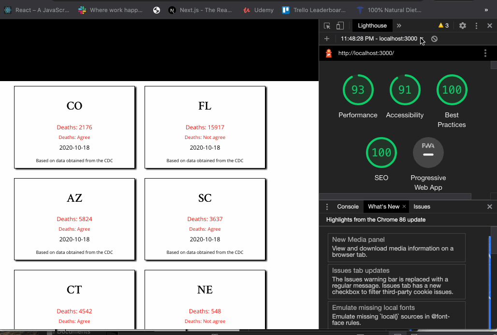

# CovidConnect
 
### `Objective`
<ul>
 <li>To provide data easy to understand wihtout overwheeling the user</li>
</ul>

### `Implementation`
<ul>
    <li>Class components are being implemented in the development.</li>
  <li>Hooks will be implemented later on</li>
  <li>JSON format</li>
</ul>
 

### `Challenges`
<ul>
    <li>As I get more familiar with components in react and the manipulation of API's. I wanted to develop a website using real data. The struggles from fetching too much data to fetch the necessary it has been taking more of the time as I wanted to keep performance to the max.</li>

</ul>
 
 ### `Note`
 <ul>
    <li>The application is not uptimized for mobile devices yet and not finish yet.</li>
</ul>

  ## Website
  <h2><li><a href="https://covid-connect-fjyhulpdy.vercel.app/" target="_blank"> Covid Connect</a></li></h2>
  

 # Performance test so far
 

